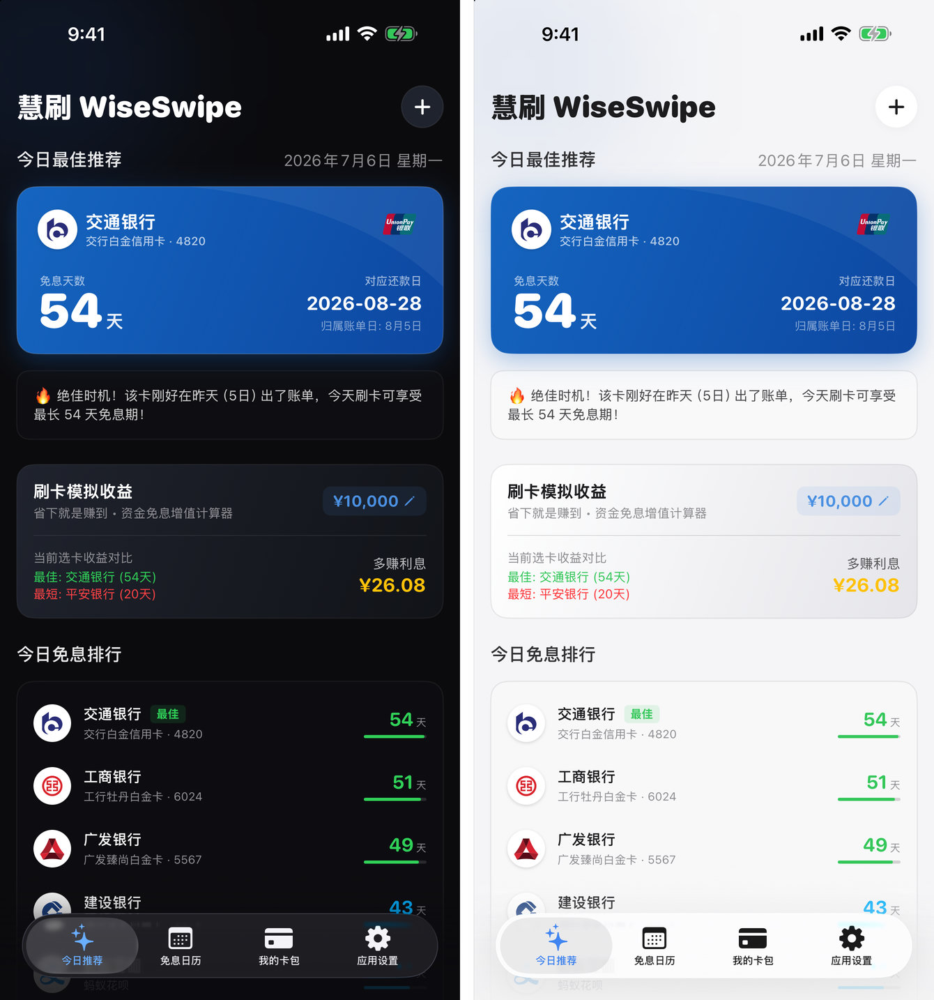
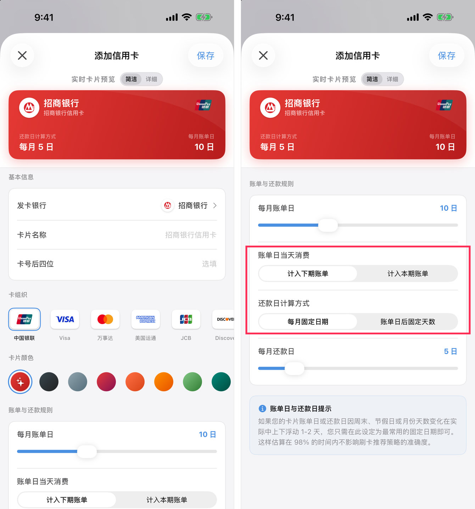
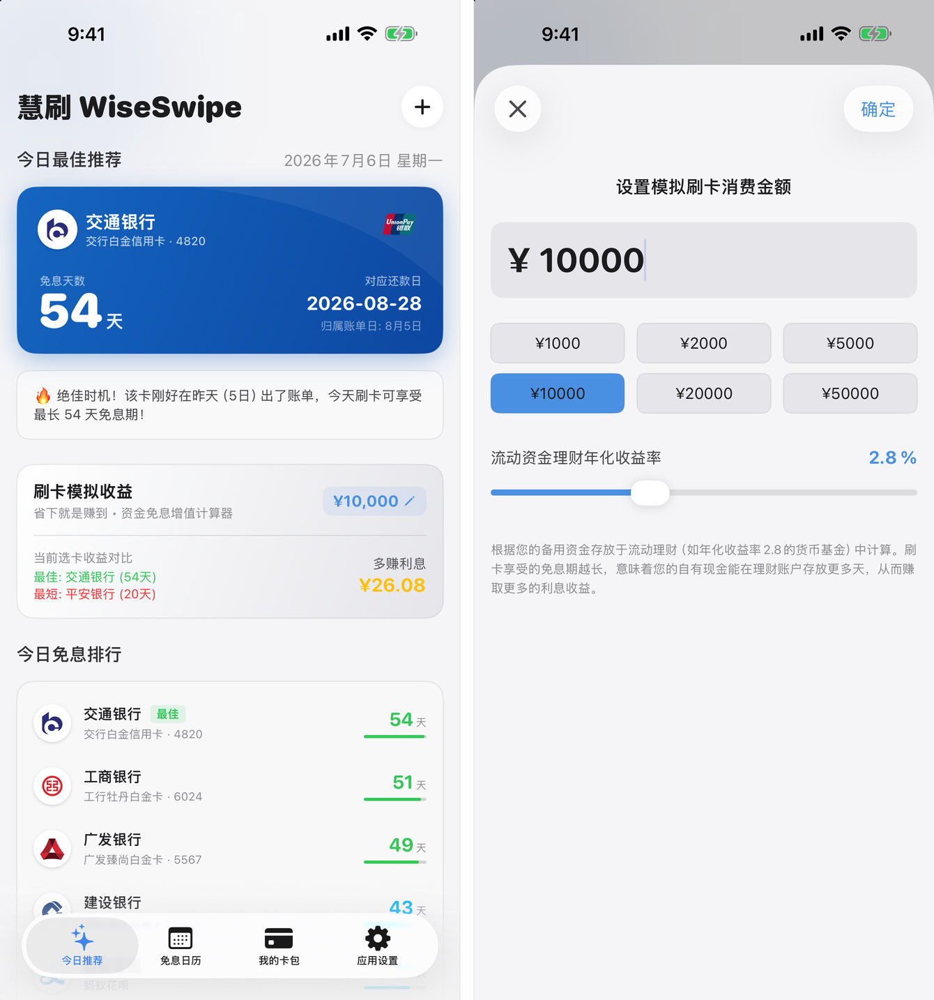
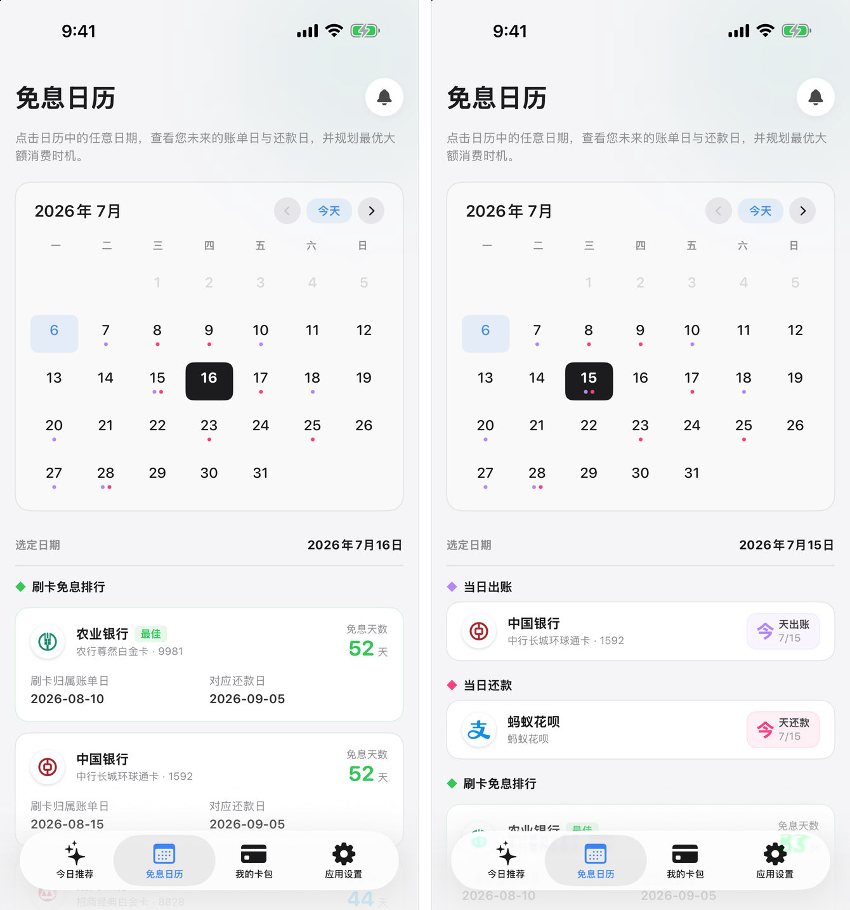
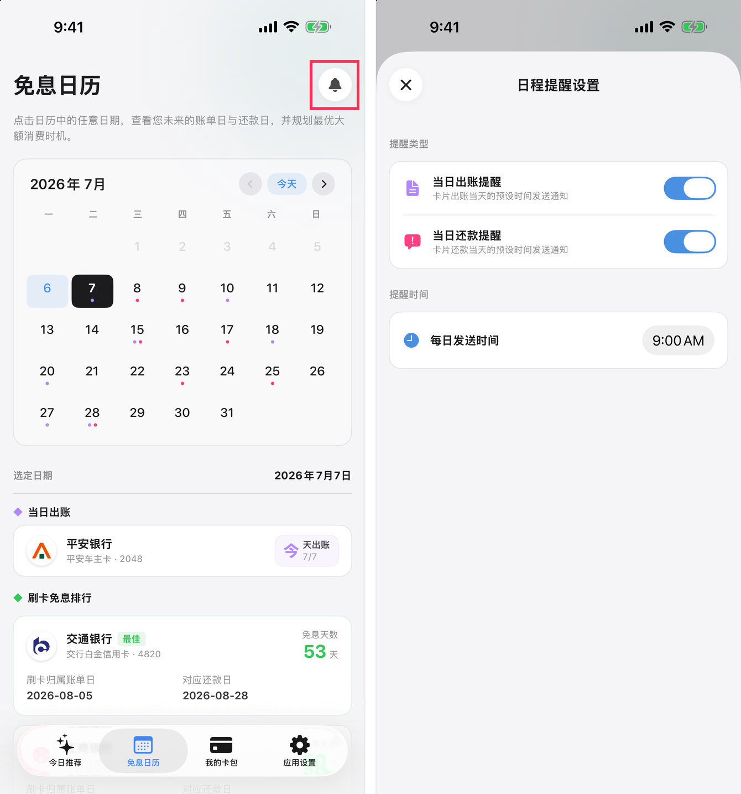
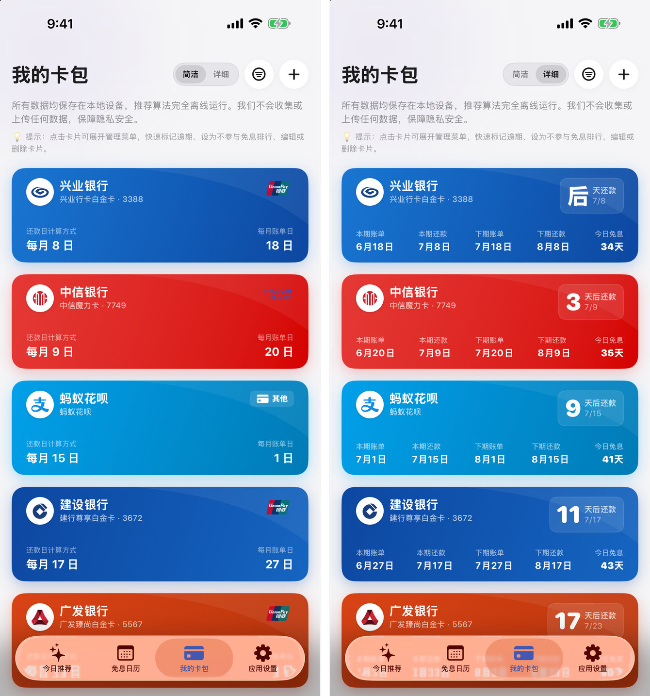
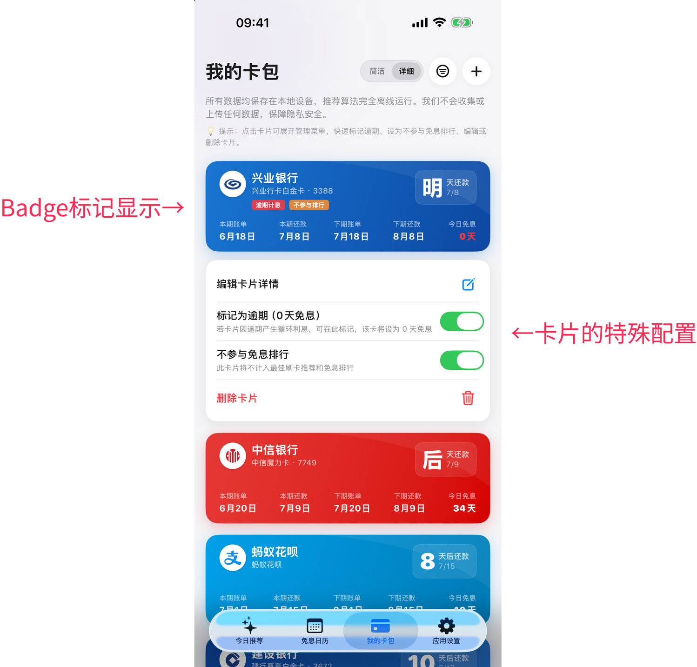
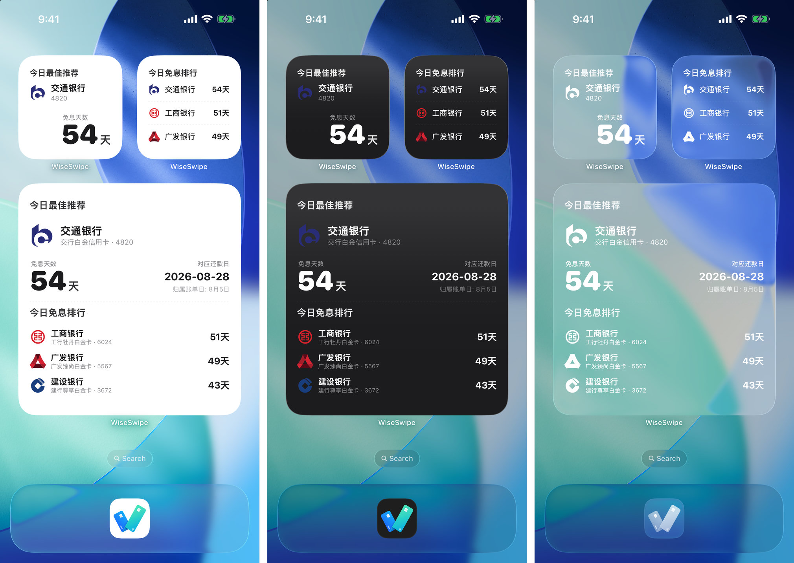
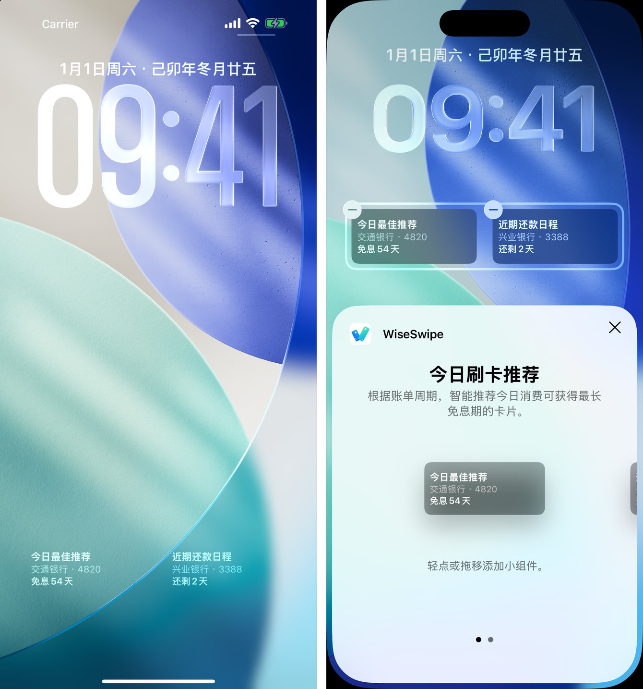

> **TL;DR 太长不看版：** 👉 [点击这里前往 App Store 下载 WiseSwipe](https://apps.apple.com/us/app/wiseswipe-interest-free-help/id6780763010) （或者在 App Store 搜索「**慧刷**」或「**WiseSwipe**」）

每到各大购物季来临要买东西，家人总会问我：「今天该刷哪张卡？」

我们都知道信用卡刷卡后不是立刻就还款，而是会把当期所有的交易汇总到一起出账（也就是所谓的账单日），当期账单在还款截止日前还款就不算逾期。这里的「交易日」到「还款日」之间的时间差，就是信用卡的「免息期」。

如果你有多张信用卡，由于每一张卡片的账单日和还款日规则不同，即使是同一天刷卡，它们的免息期当然也会不一样。所以，就有了这一种「薅羊毛」的办法：选择免息期较长的卡，意味着本来要早些还的这笔资金可以在流动理财账户（比如余额宝等货币基金账户）里多躺几天、多赚几天的利息。（虽然说现在货币基金的收益也只有那么一点啦，单次看可能也就是毛毛雨，但积少成多，况且如果是大额消费，还是有差。）并且相应地，如果在卡片刚过账单日就消费，这笔支出就能计入下一个账单周期，也就能获得最长的免息期。

不过卡片少还好，大体记一下哪些天刷哪张卡就行。卡片一多，每次都要自己去记账单日、还款日，再手动计算，时间成本和精力成本实在是不划算。所以这种事情还是得交给工具来做。

在此之前我其实也尝试过现有的应用。不过它们大多功能太重、不纯粹，许多计算免息期的功能，都被内嵌在了记账或者理财应用里。我日常是用 Numbers 记账，不需要额外的记账工具，也不需要信用卡管理工具来记录我刷了多少钱、额度还剩多少、年费减免了吗。而另外一些专门只做免息期的应用，也没有完全符合我心意的，比如没有锁屏小组件，或是设计风格不合胃口。

于是我就想，为什么不自己动手制作呢？「慧刷 WiseSwipe」就这样诞生了。

## 它有什么功能？

WiseSwipe 不能记账、不能理财，它是一款主打自动计算免息期并推荐当日消费最长免息卡片的应用。主要有这些功能：

### 今日最佳刷卡推荐

在录入卡片数据后，应用会根据今天的日期，以及每张卡片的账单日、还款日规则计算出卡片的免息期，并通过排行榜形式展示。首页最上方的卡片就是「今日最佳」，下方还会展示所有卡片的排行榜。

在添加卡片时，我们可以根据实际情况配置账单日和还款日规则，例如：

- 账单日当天消费是计入本期账单还是计入下期账单；
- 还款日是每月固定日期，还是账单日后的固定天数。

首页还有一个「刷卡模拟器」，它会对比选用免息期最长和最短的卡片，直观感受资金在理财账户多放几天能收获的利息数额。当然，这个数据仅供参考，不构成任何理财建议。

### 免息日历

除了查看每日推荐，在「免息日历」中也可以查看未来所有日期的免息排行榜。特别地，如果某一天刚好有卡片出账或还款，日历上会有圆点标注，下方也会有详细的数据。这样账期一目了然，也可以提前规划未来的大额支出。

点击右上角的铃铛按钮可以设置出账与还款提醒。不过一般银行也会通过应用内通知和短信提醒还款，如果你不想收到重复通知，这一项可以不用理会。

### 卡包管理的个性化配置

卡包列表提供了简单与详细两种视图，可以在顶部切换。目前卡片是根据还款及出账日期临近排序，未来还会加入更多的排列方式。除了卡片的基本信息，我也特意为每家发卡银行适配了他们的品牌色，这样在卡片列表中寻找起来就更加方便。

我们也可以通过以下方式自定义推荐排行榜：

- **不参与排行**：开启后，这张卡片就不会参与首页推荐及免息排行，不过还是可以继续查看免息期、追踪出账和还款日程。

  这个功能主要是为了互联网支付方式适配。在不同的消费场景中，我们可能会在传统的信用卡与花呗、京东白条、抖音月付等互联网支付方式中选择，所以也支持将这类支付方式作为特殊的卡片添加到应用中。不过相比传统的信用卡，它们有自己的使用场景限制。如果你平时不太用到它们，只是想追踪一下账期，或是偶尔作为选择对比，可以把它们设置为「不参与排行」，这样可以避免打乱日常的刷卡推荐。

- **设置逾期**：信用卡如果不小心逾期，就会产生循环利息，这时我们可以在卡包中将它标记为逾期。逾期的卡片不仅不会参与排行推荐，免息天数也会被归零。(如果卡片真的逾期了，我觉得还是先别看这个应用了，赶紧去还上要紧)

### 桌面与锁屏小组件（Pro 功能，支持预览）

在设计最初，我就认为这个工具最好是不打扰的，所以小组件功能十分必要。并且考虑到经常刷卡的重度信用卡用户，放在锁屏也非常合适。

小组件主要分为「免息排行榜」以及「还款倒计时」两类，其中：

- **桌面小组件**：款式比较多，有大、中、小三种尺寸，并且适配了深色、浅色以及透明模式。

- **锁屏小组件**：考虑到空间限制，并且锁屏小组件尽量是看一眼就能知晓结果，所以只设计了「今日最佳推荐」和「最近还款日程」这两款。

小组件属于 Pro 功能，但你可以在应用设置的「小组件预览」页面查看显示效果。

## 100% 本地应用，不收集任何数据

因为是信用卡工具，即使应用本身不涉及资金划转或理财等功能，安全和隐私也应该是第一位的。

- **没有云端服务器**：不收集和上传任何数据，应用数据 100% 保存在你的设备本地。
- **数据备份**：因为目前还没有做 iCloud 同步，需要手动导入和导出加密备份文件，未来会加入更方便的 iCloud 同步机制。
- **Face ID 保护**：应用支持 Face ID 锁定，保护卡片隐私。但我没有限制小组件的展示，毕竟我们把小组件放出来就是为了更快捷地查看。如果因为主应用锁定就把小组件数据隐藏，反而失去了它的意义。无论是否锁定，小组件依然可以直接在桌面及锁屏查看。

## App Icon 设计分享 🎨

WiseSwipe 的 App Icon 设计融入了许多小心思。

它的整体轮廓是一个大写字母 **「W」**（取自应用名称 WiseSwipe 的首字母），由一长一短两张信用卡组合而成。两张卡片摆放像一个对勾 ✅，一长一短也寓意着「最优之选」。

与小组件一样，App Icon 也做好了深色、浅色与透明模式的适配。

## 未来规划 Roadmap

- iCloud 数据同步：方便多个设备同时使用。
- Watch Companion App：在手表上直接查看今天该刷哪张卡。
- 适配更多的国家与地区：目前已支持中国大陆和美国的主流银行。因为要根据每一个国家和地区的实际情况去适配，需要一点时间。目前的设计是选好了国家和地区，预设的银行就会随之改变。我还没有想好如果同时有在用多个国家与地区发行的卡片，该怎么处理。
- 收录更多的预设银行、增加多种卡包排序方式等。

如果你也和我一样，拥有多张信用卡，想要每次都刷到最「划算」、免息期最长的卡片，不妨试试「慧刷 WiseSwipe」。希望它可以帮到你，也欢迎随时在 App Store 和文章评论中提意见和反馈～
