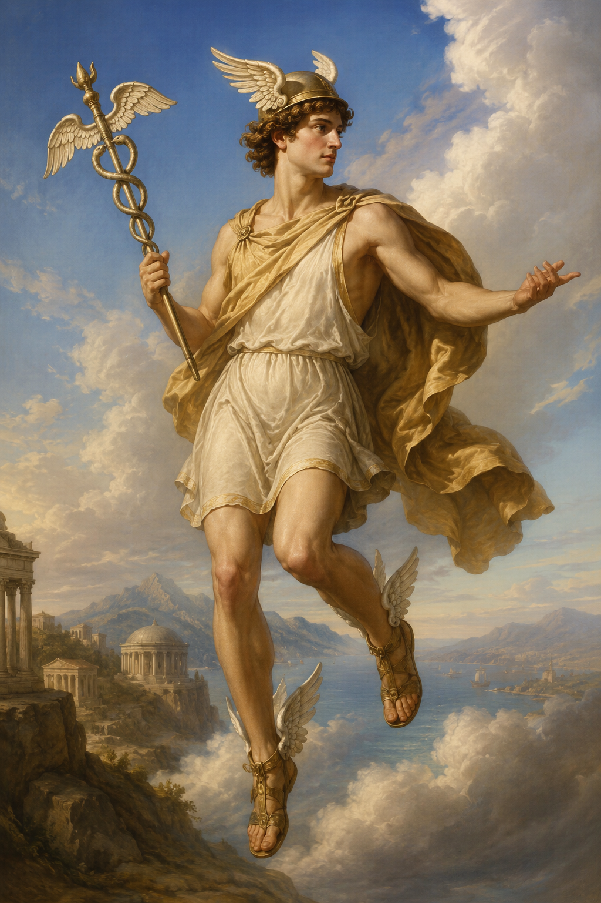
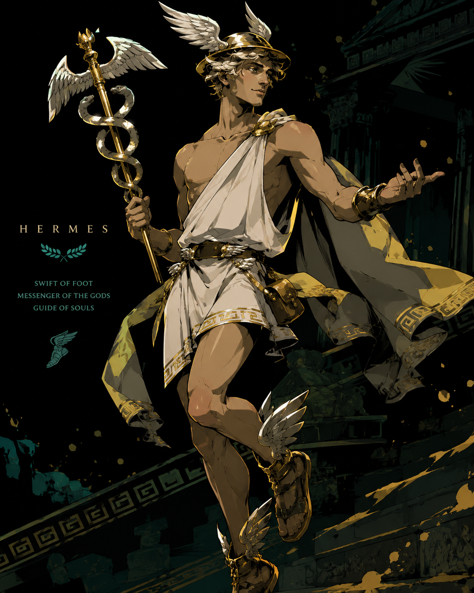
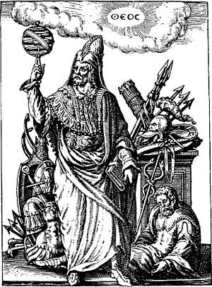
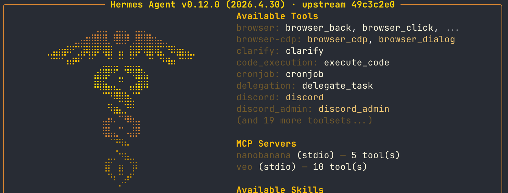
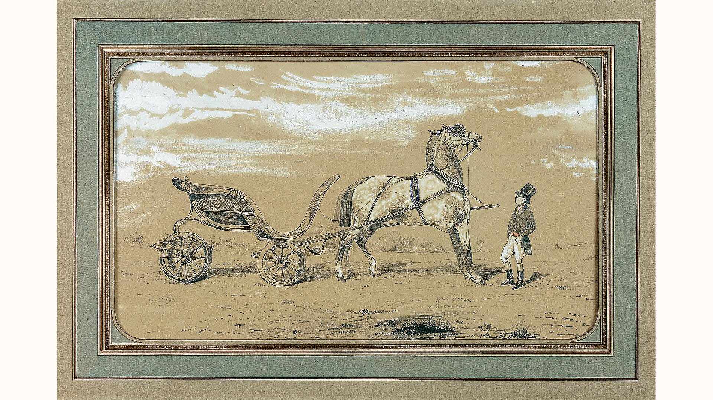

> 这是「阅读边角料」系列的第二篇。

我刚开始关注 Hermes Agent 的时候，它在 GitHub 上还只有一两万个 Star。没想到增长速度势如破竹，写这篇文章时，星标数已悄然越过了 13.5 万的大关。关于它的文章、教程已经很多了，我们这一篇就不讲怎么用或者它的架构之类的，而是单纯从命名出发，分享背后那些有意思的故事。因为这个名字起得真的很妙 **☤**

听到 Hermes 这个名字，熟悉西方文化的读者，大概会想到希腊神话里的神使赫尔墨斯（Hermes），又或者是来自巴黎的奢侈品牌——爱马仕（Hermès）。当然，Hermes Agent 的命名主要是源自神话，不过我们后面还是要「硬关联」一下爱马仕，因为里面藏着一个特别神奇的巧合，我自己都想不到，竟然真的能串起来。

## 奥林匹斯山上的「越界者」

在奥林匹斯十二主神里，赫尔墨斯（Hermes）大概是最「不端着」的一位大忙人。他是诸神之王宙斯和仙女迈亚的儿子，属于年轻一代的主神，也是一位天赋异禀的「斜杠青年」。

传说他出生的第一天，就展现出了天才般的创造力。他刚出生不久就和妈妈说要出去散步，找了个乌龟壳蒙上牛皮，做成了历史上第一把里拉琴。到了晚上，闲不住的他还顺手偷了同父异母哥哥阿波罗的五十头神牛。为了不被发现，他教牛学会了倒着走路来伪造脚印，还编织了巨大的草鞋掩盖自己的行踪。就连执掌预言的阿波罗都被耍得团团转。

阿波罗很生气找他算账，但是能怎么办呢？人家毕竟还只是一个小宝宝 👼🏻 最后是凭借机智的辩才和那把动听的里拉琴安抚了愤怒的哥哥，顺势用琴换下了牛群。阿波罗自此沉迷音律，成了音乐之神。后来，里拉琴成为阿波罗的重要象征之一，也影响了后世许多弦乐器的发展。当然这一切还得拜这位刚出生的弟弟所赐。

这样闪电般的灵活加上「诡计多端」的行事风格，不仅让赫尔墨斯全身而退，还让他顺理成章地成了商旅、贸易乃至盗贼的保护神。

赫尔墨斯在神话中最独特的身份是众神的信使。锻造之神赫菲斯托斯为他打造了一顶带翅膀的帽子，搭配一双带翅膀的飞行鞋。而这套装束也成了他的标志性形象。

他也是除了冥王哈迪斯和冥后帕耳塞福涅这两位「常驻人口」之外，少数能够自由往返冥界的神祇之一。他负责引导灵魂到达冥河，因此也被称为引魂之神（Psychopomp）。

除了担任信使，他还是口才与雄辩之神。传说中闲不住的他还发明了字母表、度量衡、骰子和体育竞技。总之，凡是涉及信息交换、逻辑构建、语言表达或跨越边界的地方，几乎都有他的影子。听起来是不是和 AI Agent 做的事情特别像？

如果你对赫尔墨斯这个希腊名不太熟，那多半听过他的罗马名——墨丘利（Mercury）。没错，就是水星。古罗马人从希腊那里借用这位神明时，除了保留他主管商业的职能，也延续了他作为沟通者和智者的化身。后来，人们把太阳系里公转跑得最快的行星也命名为 Mercury 水星。在占星学中，水星恰好也掌管着沟通表达、思维逻辑和信息传递，与其神使的身份一脉相承。

再延伸开去，水银这种金属也写作 mercury。古希腊人叫它 hydrargyros（即液态白银），这也是元素符号 Hg 的来源。罗马时代以后人们渐渐开始使用 mercury 这个名称，因为它是常温下少见的液态金属，流动迅速，难以捉摸；又很容易和别的金属形成汞齐，像是在穿梭渗透，很像神使墨丘利。到中世纪炼金术时期，mercury 已经不仅是金属名，还变成一种哲学概念：它象征流动、转化、媒介、灵魂与物质之间的连接。

不过，这个如果再展开去，就偏向神秘学领域了。感兴趣的读者可以查询 Hermes Trismegistus（三重伟大的赫尔墨斯）。他是希腊神赫尔墨斯与埃及神托特（智慧与书写之神）融合而成的神秘形象，也是赫尔墨斯主义哲学（Hermeticism）的核心人物。

## Call Me By Your Name

看到这里，你大概已经猜到开发团队 Nous Research 为它起名 Hermes 时的深意。这个名字延续了团队旗下的 Hermes 系列模型，象征着快速、可靠的信息传递。

Nous Research 本身也是一个富有浪漫色彩的团队。它最初只是一个在 Discord 和 Twitter 上协作的「数字原生」技术社群，后来才逐渐正式化。团队名字 Nous（νοῦς）在希腊语里就是心智或理性的意思，代表着一种直觉性的理解力。

在他们的愿景里，AI Agent 不应只是一个执行机器，而应该是一个拥有持久记忆、能够自我进化的心智实体。Hermes Agent 的核心能力——在 Telegram、Discord、Slack 等平台自由穿梭，在不同的大语言模型、外部工具和用户指令之间调度，简直就是赫尔墨斯「边界之神」身份的现代版实现。

Hermes Agent 里面也藏着许多彩蛋。提起赫尔墨斯，就不得不提他的标志性法器——双蛇杖（Caduceus）。传说赫尔墨斯曾用手杖调停了两条正在打斗的蛇，从此双蛇缠绕，成了沟通、和平与秩序的象征。当我们在终端里使用 Hermes Agent 的 TUI 时，屏幕上会跳出一个大大的双蛇杖图案（☤）。在它调用工具执行任务时，还能在输出中看到欢快的小蛇 Emoji（🐍）。

## 是 Hermes，也是 Harness

接下来我要「硬 cue」一下爱马仕了。也许大家会因为拼写联想到爱马仕（Hermès）。虽然品牌创始人蒂埃里·爱马仕先生当初命名只是因为自己就姓这个，毕竟用姓氏为自家品牌命名再正常不过。而爱马仕这个姓氏词源有不同说法，一说来源于古普罗旺斯语，意为「居住于荒芜之人」，跟赫尔墨斯同名大概只是巧合，没有什么直接联系。

但是——

爱马仕最初的业务并非售卖皮具与手袋，而是一家为欧洲贵族制作高级马具（Harness and Bridles）的工坊。在品牌设计中，也总是能看到经典的马车形象。

看到上面括号里的英文字了吗？**Harness**。没错，就是它 🎠 最近都要被这个词刷屏了……

在软件工程中，Harness 指的是测试框架或控制套件等，例如现在 AI 工程领域中 Agent Harness 的概念。大语言模型如同一匹难以预测的烈马，若无一套精准、柔韧的 Harness 去引导和驾驭，它的力量也没办法好好发挥。模型自身的进化固然重要，一套好的 Harness 也同样重要。

所以我说这个名字起得很妙吧。它是神话中穿越边界、主管沟通的神使（Hermes）；它是历史上技艺精湛的马具匠人（Hermès）；它也是现代 AI 语境中，我们驾驭大模型的 Agent 框架（Harness）。

当然，我不知道 Nous 团队起名时，有没有想这么多。这篇文章完全是因为最近太喜欢用 Hermes Agent 了，刚好也在阅读神话，考据魂大满足。

---

注：

- 两张赫尔墨斯的图片是 ChatGPT 制作的。本来想用鲁本斯的画作，但是感觉不太合适。后来又做了一个游戏哈迪斯风格的，以此作为题图。
- 神话流传有不同的版本，有些版本细节与我所说可能不太相符，大家也不必过于在意。初衷只是想分享背后的故事，让大家在用的时候能够会心一笑。
