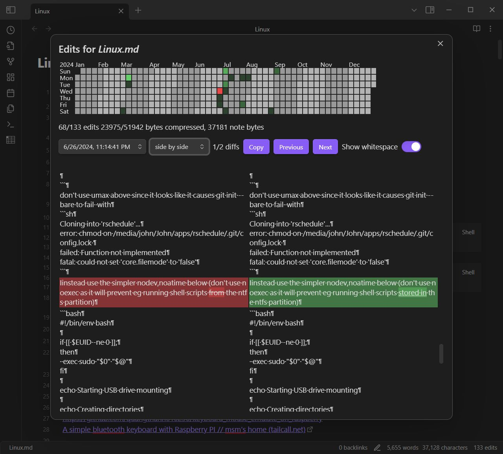
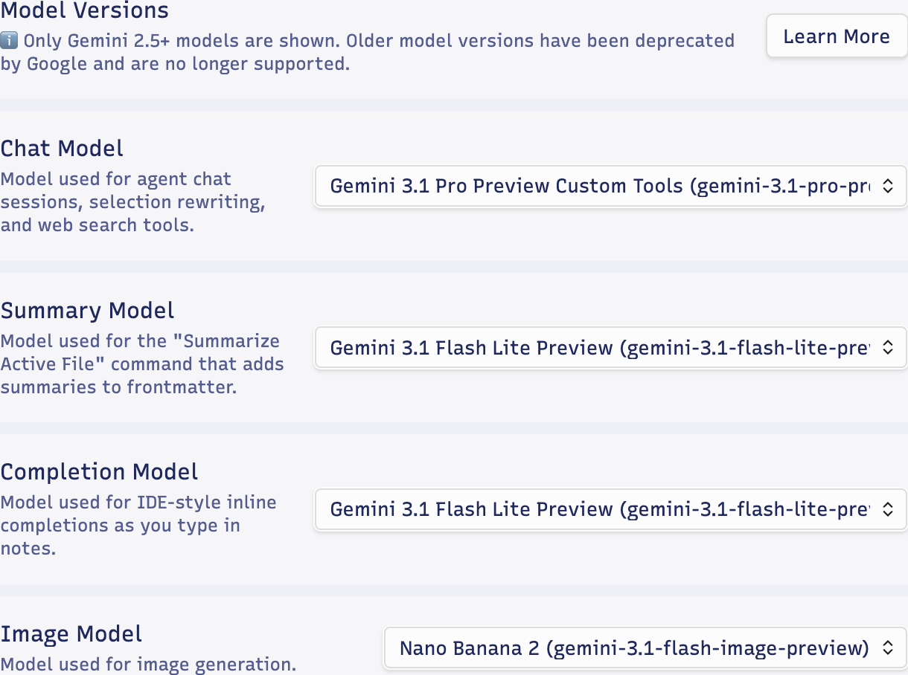

今天想稍微分享一下 Obsidian 使用 [Gemini Scribe](https://github.com/allenhutchison/obsidian-gemini) 插件的一些感想。

## 搭配一个 Diff 插件

本来我很喜欢用 Gemini 网页版的 Canvas 来辅助写文章，只要有个能打开网页的设备就能写，不用装这装那，界面漂亮，还是个 PWA。但是它会主动渲染 Markdown，而且导出体验不太好，所以有时候我还是会回归到 Obsidian 里写。

在 Obsidian 里写的话，目前搜 Gemini 插件，发现基本上就这个 Gemini Scribe 是最好的，但是非常建议搭配一个 Diff 插件一起用（比如我用的是 [Edit History](https://github.com/antoniotejada/obsidian-edit-history) 这一个）。

之前在网页版 Canvas 模式下写的时候，它改了哪里会有蓝色的高亮，非常明显（虽然说这个蓝色的高亮只要你鼠标点了一下别的地方它就会消失，好像也没什么用🤣）。但换到 Obsidian 的 Gemini Scribe 对话框里，虽然它也会提示你改了什么地方，但在正文里其实是看不出哪里改动了的，只看对话框的改动说明不够直观。所以 Diff 就派上用场了。

如果你整个 Vault 本身是用 Git 进行版本管理的，那 Diff 插件的选择会有很多，比如可以选用 [Version History Diff](https://github.com/kometenstaub/obsidian-version-history-diff)。如果你的 Vault 没有用 Git，我比较推荐一款基于内建 File Recovery 功能来查看 Diff 的插件，就是前面提到的 Edit History。它的界面跟我们常见的 Diff 一样，也是红红绿绿的，支持 Previous/Next 跳转，视图也可以选很多种（左右、上下都可以），还蛮方便的。

下面的图片是从作者那里偷来的：

## API 与模型选择

说回 Gemini Scribe，我个人建议使用付费的 API Key。

虽然 Google 给免费 Plan 的配额还是很足的，但它明确说了：使用免费 Plan，你的内容会被用于训练模型或提供给 Google 的其他服务。这个是关不掉的，只有付费的才不会。各个国家的条款不太一样，比如有些地方可能只能使用付费 API，不过基本情况就是免费的数据会被拿去训练。因为笔记毕竟还是比较私人的东西（当然，如果只是写博客本来就要公开，那倒无所谓？）。

有些最新的模型（比如 3.1 Pro Preview）和所有的 Nano Banana 系列模型，是不能用免费 API 调用的。不过就算付费了，这个 3.1 Pro 的 RPD（每日请求上限）还是很快就满了。我在想我都付费了，为什么还要给我搞个 RPD 限制……反正我用多用少，花掉的都是我自己的钱嘛。可能是因为它现在还处于 Preview 阶段，给的 rate 就比较低。

想想我在 Gemini App 和 CLI 里面乱开 Pro……所以日常使用需要大小模型搭配着来。插件里模型是可以分开设置的，不过搜索用的模型是和 Chat 模型用的同一个。

## Agents 架构与会话记录

其实它用的就是现在最 fancy 的 Agents 那一套，比如根据内容自动生成和更新 `Agents.md`、创建和使用 skills 都是支持的。

既然是 Agents 那一套方案，可能会觉得：我直接在 Claude Code 或者开个 IDE 好像也可以。但我觉得在 IDE 或者 Terminal 里面搞超长的 Markdown 感觉很难受，反正我是接受不了在 IDE 里面写文章的🤣。在 Obsidian 里面就很舒服，感觉它非常接近网页版 Canvas 的使用体验，而且因为 Obsidian 本来就可以深度定制，最终使用体验还会更好。

我也非常建议在设置里开启 Session History。开启后，它会把每一次完整的对话 Session 保存到 Agent Sessions 文件夹下的一个 Markdown 文件里。这个 Markdown 渲染得超级好看，把你的输入、Assistant 的输出以及模型执行的动作，用不同的背景颜色分得很清晰。回顾的时候非常方便，比在对话框里使劲往上翻好太多了。

## 其他小细节

虽然它会自动抓取所有当前打开的文件作为 Context，不过好像没办法设置成「只抓取当前聚焦的那一个 Tab」。也可以手动添加 Context 文件，以及使用 `@` 引用文件夹或文件。只不过它的「自动添加文件」功能好像有些 Bug：有时候识别不准，没有立即更新，有时候删了一个文件结果列表全给清空了。所以我还是比较喜欢用 `@` 或者直接用文字描述，反正它都能找得到。

它也支持 MCP Server，不过这个选项藏得比较深，需要在设置里找到 Advanced Settings，然后一直往下翻，翻到最后面才能看到。
