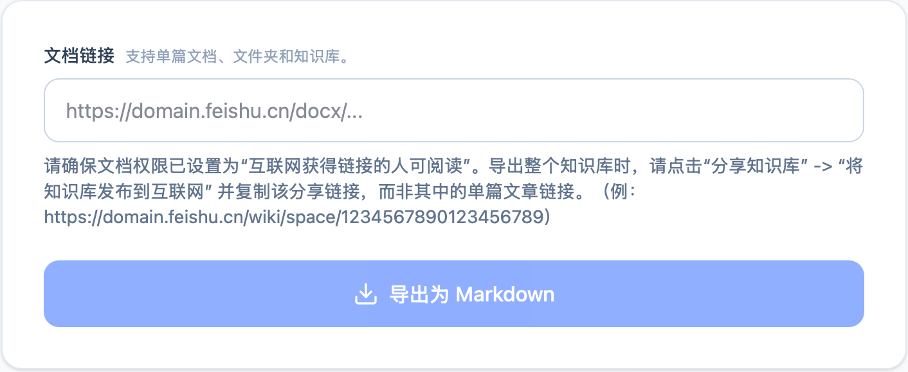
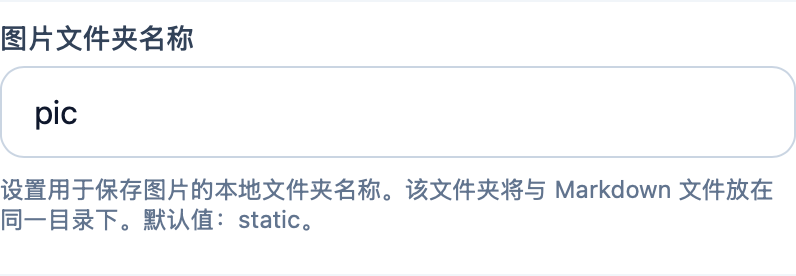
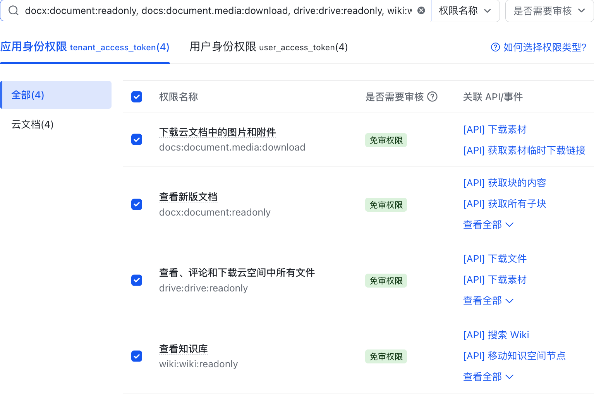

> **太长不看版**：
>
> 可以直接[在这里下载](https://github.com/bakabakamio/Feishu2MD-Exporter/releases)。遇到不安全警告是因为我没有签名，可以在系统设置「隐私与安全性」中主动放行。
>
> [在这里阅读项目说明](https://github.com/bakabakamio/Feishu2MD-Exporter)，遇到问题可以在 Issues 里面反馈或者直接在文章中留言。


我之前把飞书文档批量转为 Markdown 文件保存到本地时，使用了 Wsine 开发的一个 [Feishu2MD 的 CLI 工具](https://github.com/Wsine/feishu2md)。它是用 Go 实现的，支持单文档、文件夹以及知识库下载。因为真的很好用，我就想着给它做一个 GUI Wrapper。

后来我发现飞书官方也有自己的 [Lark CLI](https://github.com/larksuite/cli)，功能更全支持更多的 API，但我其实还没用过。官方这个 CLI 似乎只能导出单个文件，而不支持批量导出文件夹/知识库。虽然说官方 CLI 能更好地与 AI Agent 集成，不过单纯批量导出 Markdown 这个任务已经有 Feishu2MD 了，直接用它就很好。另外，像图片本地化和链接替换这些功能，我也不确定官方 CLI 有没有实现。

但是这些都是后话，因为我一开始的目的，其实就是给 Feishu2MD CLI 做一个 Wrapper🤣。在此基础上也追加了一些我自己会用到的功能。

虽然飞书以后可能会更新文档结构或者接口权限，这个工具以后可能会不适用，但目前用起来还蛮好的。

## 追加优化的点

它和原版的 Feishu2MD CLI 主要区别在于——当然了，一个是命令行工具，一个是图形界面嘛。不习惯使用 CLI 的朋友可能会更喜欢用它。那么接下来介绍一些追加的特性：

### 文档链接的智能识别

原本 CLI 需要用不同的命令去下载单个文档、文件夹或知识库，现在我统一成了一个链接输入框，所有的链接都能直接放进去，会自动帮你路由。



也追加支持了知识库分享 `wiki/space` 格式链接。这个链接可以通过点击「分享知识库」按钮得到。原本的 CLI 如果要下载知识库，只能填写知识库设置页面的链接（即 `wiki/settings`），但我觉得使用分享链接更符合直觉。现在两种链接都可以识别，我在底层做了一层替换。

### 文件名作为 H1 处理

可以选择是否将飞书文档的文件名作为一级标题插入正文顶部。默认是开启的，考虑到大家可能已经在正文添加了一个 H1 Heading，取消勾选此项可以避免导出后标题重复。


### 文件重命名

原本 CLI 下载的文件名通常是一串从 URL 获取的文档 Token，这样子下载到本地以后，就不能一眼知道是什么内容。所以追加了将文件名重命名为真实的文档标题，并自动将非法字符替换为下划线的选项。


至于文档间的相互链接（即 Markdown 文件中互相引用的链接），虽然有做两遍扫描，但我目前还没有好好测试，大家在使用中如果发现问题可以随时告诉我。

### 图片存放路径

支持修改存放图片的本地文件夹名称，默认为 `static`，可以根据习惯修改为 `pic`、`image` 或 `assets` 等等。图片文件夹会存放在 Markdown 文件的同级目录下，方便后续迁移。



同时我也把 Markdown 中的图片路径改成了相对路径。原本 CLI 使用的是绝对路径，移动后图片就失效了，改用相对路径后就没有这个问题。

### 默认保存文件夹

在桌面端，App 会在指定位置下创建带时间戳的文件夹来保存导出结果。服务端因为浏览器下载的限制，会把所有的内容打包成一个 ZIP 包，然后下载下来（保存位置遵循浏览器的设置）。


## 安装和使用

可以在 GitHub Release 下载 Windows 和 Mac 版本的安装包。下载好以后，只要配置好飞书应用凭证，其他什么都不用做，直接就能用。

由于目前还没有签名，系统可能会识别为不安全。安装时跳过警告即可。如果不放心，也可以将代码拉下来让 AI 检查后在本地运行构建。如何构建可以查看 README 中的说明。

另外，如果想在服务器部署或使用本地网页版，也可以参照 README 中的说明。服务器版和桌面版的下载核心机制和 UI 界面都是通用的一套。服务器版支持通过 ENV 注入飞书应用凭证并通过 Access Code 控制访问权限，防止他人滥用。

在使用前，我们需要准备飞书应用的凭证，具体步骤如下：

### 1. 获取应用凭证

登录[飞书开发者后台](https://open.feishu.cn/app)创建企业自建应用。应用名称和应用描述随便填，自己能分清楚即可。


在「权限管理」页面，搜索并开通以下**应用身份**权限（注意：我们需要开通的是「应用身份」而非「用户身份」权限）：

- `docx:document:readonly`
- `docs:document.media:download`
- `drive:drive:readonly`
- `wiki:wiki:readonly`

你可以直接复制这里的权限字符串进行搜索。整个复制到输入框后，就会出现对应的权限，全选开通即可：

```text
docx:document:readonly, docs:document.media:download, drive:drive:readonly, wiki:wiki:readonly
```



创建版本并发布后，在「凭证与基础信息」中找到你的 **APP ID** 和 **APP SECRET**，并填入 App 设置中。


### 2. 配置文档权限

确保你要导出的飞书文档、文件夹或知识库已经开启了「互联网上获得链接的人可阅读」权限。

导出整个知识库时，请点击「分享知识库」 → 「将知识库发布到互联网」 并复制该分享链接，而非其中的单篇文章链接。正确示例：

🔗 https://domain.feishu.cn/wiki/space/xxxxxxxx

### 3. 开始导出

复制文档、文件夹或知识库的 URL 并填入首页的输入框，再点击「导出为 Markdown」就可以了。

Voilà，就这么简单。

## 开发的一些碎碎念

因为我从来没有做过桌面端 App，虽然只是通过 Tauri 打包了一下，但是整个过程还是学到了蛮多有意思的东西。

最开始我只是在 Google AI Studio 上随口说了一句，想要给 Feishu2MD 做个 Web Wrapper，这样我不管在哪里都能用。结果它很快就做出了雏形。虽然最初只能导出单个文档还有 bug，但慢慢调试下来感觉已经很好了。后来我想不然搞个桌面端呗，考虑到这是用 Google AI Studio 做的，就决定用 Google 自家的 Antigravity 继续。

平心而论，虽然说 Antigravity 好像是第一个使用 Agent Manager 这种形式的 IDE，但我觉得它很难用…但是既然有 Google AI Pro 订阅，不用白不用嘛🤣

发现 Antigravity 里面的模型配额是这样的：Gemini 3.1 Pro High 和 Pro Low 是一个池子的，Gemini 3 Flash 是一个池子的，然后其他家的模型比如 Claude Opus 和 Sonnet 是一个池子的。另外 Google AI Pro 每月还有 1000 点 AI credits，本来我以为只能用在 Flow 里做视频用，后来发现其实是跟 Antigravity 共用的。当 5 小时配额 & 周配额用完后，可以选择继续使用这些点数。

看起来好像还不错？但我真的觉得 Google 做产品很乱。有一阵子，Antigravity 里面不管用什么模型都显示服务器忙，连 Flash 模型都忙，也不知道到底在干嘛。当时 Gemini CLI 也有问题，一直说我没有权限使用，但提示的是我正在使用一个并不属于我的 Google Cloud Project…退出重新登录也没用。当时好像很多人都有这个问题。

总之它所有东西都用不来，只有 AI Studio 能用。AI Studio 倒是又更新了不少小东西🤣🤣。然后它居然把 Flow 又独立了一个专门做音乐的 Flow Music 出来（虽然好像是原本的一个产品改名），甚至还能做音乐 Playground（也是类似于 Web App）。每次看到它更新，我就在想你能不能把坏掉的先修修好。现在倒是都好了都能用哈哈哈。

Antigravity 也只有 Plan 和 Fast 模式，顾名思义，Plan 就是它会先规划再执行，Fast 就是直接执行。但是我觉得有时候 Plan 和 Fast 有啥区别啊？它也没有给我 Plan…被其他的惯坏了，我还蛮希望它有开箱即用的 Debug 模式之类的，不用我自己配。

前面是 IDE 的一些小吐槽。其实这件事情本身对我来说比较难的一个点是发布 Release 版本。因为我不想每次都自己打包然后手动上传，所以 AI 帮我写了一个 workflow 文件。现在的流程是打上版本 tag 之后 push 到 GitHub，会自动触发 GitHub Actions，自动运行打包任务，完成后创建一个 Release Draft，我看没问题就可以直接点公开。

最初调试的时候这些 Action Jobs 都失败了。那怎么办呢我可不会改。我就想不是给它配好了 GitHub MCP 吗，也开了 Actions 的读取权限，那我直接让它自己排查错误就好了。但它就是修不好，后来我烦了，直接把 Error Message 贴给它，一下子就修好了…

所以是我哪里没做对，还是说 GitHub Actions 就比较难？但是因为我现在已经跑通了，暂时也不会去碰其他的 Release，这个问题就先放着了。

Anyways，祝大家使用愉快！😋
