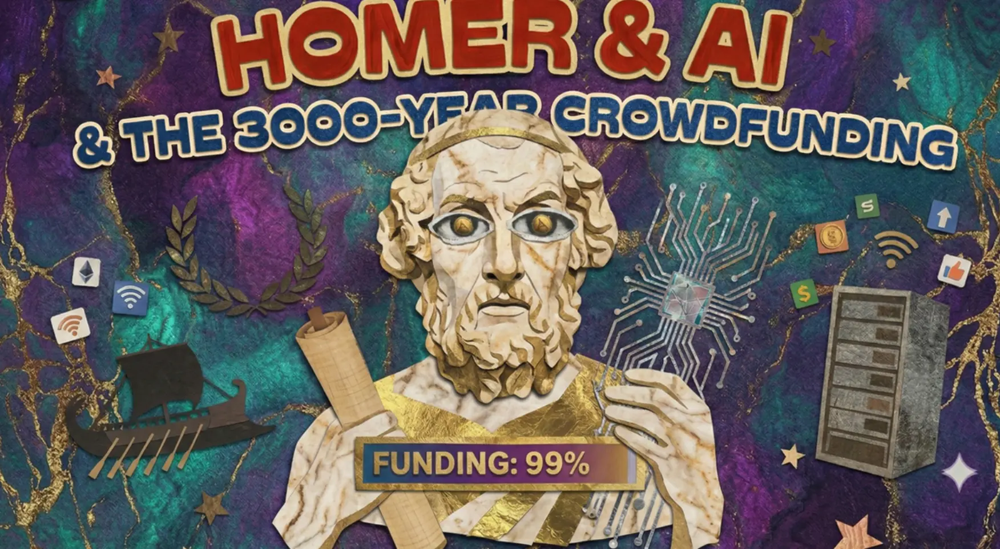

## 前言

这篇文章的由来，是我在阅读斯蒂芬·弗莱（Stephen Fry）的《奥德赛》时，在后记中看到作者写下了一段非常有意思的文字。他将「荷马」的创作方式与现代的人工智能进行了类比，我觉得这两个看似风马牛不相及的事物被放在一起，碰撞出了一种奇妙的火花。有了这个引子，我便顺手把这些想法丢给了 Gemini，让它帮我解释和发散一下。

因为这本《奥德赛》似乎还没有出版中文版，所以我遇到一些喜欢的段落，就直接让 Gemini 帮我翻译。说实话，有些地方它实在翻译得太贴切、太地道了。比如它把形容天生跛足的锻造之神赫菲斯托斯的话译成「外貌不够才华来凑」，又因为某个角色上了年纪就把「小鹿乱撞」换成了「老鹿乱撞」。很多地方简直是神来之笔，比我看过的许多商业译者翻译得要好上不少。

所以我忍不住问它：「你觉得在翻译这件事上，哪些东西是你比普通译者做得更好的？但又有哪些是哪怕你这么厉害，也依然不及顶级人类译者的？」它给了我一些非常诚恳且触及灵魂的回答。

而在前几天，我又碰巧看到了 Hobonichi 的糸井重里先生在他每日的随笔栏目「今日のダーリン」（今天的 Darling）中写的一篇关于 AI 的短文，其中也细腻地指出：对 AI 而言，那些「故意不去问它的事」，以后或许会变得越来越重要。

斯蒂芬·弗莱的绝妙类比、一场关于翻译本质的对话，以及糸井重里先生对「人类经验」的深层洞察——这三个片段奇妙地组合在了一起，便有了你现在看到的这篇文章。它并非严谨的学术论证，而更像是一场在算法时代里，寻找人类自身倒影的随笔。

## 作为「远古算法」的荷马与跨越三千年的众筹

我们在讨论 AI 时，往往认为它是一个前所未有的现代怪兽，正如科幻作家特德·姜（Ted Chiang）那句著名的评价：生成式 AI 就像是「互联网所有文本的一张模糊的 JPEG 图像」。但或许，我们对此早就不陌生。在《奥德赛》的尾声，斯蒂芬·弗莱就抛出了一个让古典文学爱好者有些「心碎」但又无比精准的观点： **荷马可能根本不存在，他更像是一个「众筹」出来的集合体。**

在许多读者的想象中，荷马是一位失明的老诗人，一口气写下了《伊利亚特》和《奥德赛》这两部气势恢宏的史诗，被尊为西方文学的祖师爷。但在现代学术视野中，「荷马」未必是一个具体的名字，而更可能是一段漫长口述传统的结晶，是几代吟诵者不断创作、修补与叠加的产物。

弗莱在书中是这样写的：

> 如果荷马这个人在现实中确实存在过、确实呼吸过，那么他极有可能是多位「吟诵诗人」的集合体。这些艺人全凭记忆背诵诗篇，他们运用流畅的、每行十二至十七个音节的诗行（即著名的「六音步长短格」），并配合各种修饰语（例如「暗酒色的海洋」、「灰眸女神雅典娜」、「聚云者宙斯」，以及其中最广为人知的「玫瑰色手指的黎明」）来辅助表演。

想象一下三千年前的场景：那些古希腊的游吟诗人并不具备现代意义上的「原创」概念，他们更像是在「调取数据」。他们的大脑里储存着海量的模块、固定的诗句和修饰语。比如「玫瑰色手指的黎明」并不只是为了好听，更是因为这几个词的音节恰好能完美填补诗句的空缺，是一个可以随时调用的「文本插件」。当他们在篝火旁表演时，其实是在根据听众的反应，实时将这些「数据块」拼凑成史诗。

这就不可避免地让人联想到今天的生成式 AI。

如果你觉得 AI 能够写出精彩的故事是一件不可思议的事，不妨听听叙事学（Narratology）是怎么说的。它试图说明： **人类的想象力其实是有边界的，讲故事是有「模板」的。**

文学理论家们试图把人类所有的故事归纳为几种固定的基本情节。最著名的分类可能是克里斯托弗·布克曾花了几十年时间研究提出的，世界上所有的故事其实只有「七大基本情节」——战胜怪兽、白手起家、任务远征、旅行与回归、喜剧、悲剧和重生。而心理学家荣格和神话学家坎贝尔则告诉我们，所有故事里的角色也无外乎几种「永恒的原型」：英雄、导师、阴影（反派力量）、变形者（身份不明、立场摇摆的人）等等。

弗莱在书中随口调侃的「世上只有九种或十种故事/五种或六种原型」，其实正是在幽默地回应这类理论在数量划分上的学术争议。但它们的核心指向是一致的：既然所有的故事都能被归类为有限的情节走向，既然所有的角色都戴着固定的原型面具，那么只要 AI 理解了这些「配方」，它就能像「众筹」一样，在数以亿计的人类文本中找到最符合「史诗」的概率分布，无缝拼贴出英雄的落难与荣光。

在这个意义上，现代的 AI 完美继承了人类最古老的「讲故事算法」，它是人类文明继荷马史诗之后的又一次大规模「众筹」。

**但是，把荷马直接比作古代版的 ChatGPT，是否太轻视了人类苦难的重量？**

这里存在一个不可忽视的本质区别：AI 拼凑数据，是因为它只有数据；而古希腊的游吟诗人在篝火旁「拼凑」诗句时，他们和听众 **呼吸着同样的空气，经历过同样的战争创伤，面对着同样的饥饿和死亡** 。诗人能看到听众眼角的泪水，能感受到人群的战栗，从而实时调整自己叙述的情绪。这是一种肉身与肉身的共振。

哲学家雅斯贝尔斯曾提出过一个「轴心时代」（约公元前 800 年至公元前 200 年）的概念。在那时，古希腊人正是从这种「集体的神话迷思」中挣脱出来，诞生了如苏格拉底那般独立思考的个体。而现在的 AI 时代，我们似乎在走回头路——我们正在把无数个体的独立思想打碎，喂给一个巨大的「数据池」。在这个被称为「人类思想圈」（Noosphere，即由全人类思想与知识汇聚而成的全球意识层）的庞然大物面前，我们越来越像是一个没有面目的集体，这才是让人隐隐不安的所在。

## 普罗米修斯的火种，那喀索斯的倒影

既然 AI 和荷马一样会讲故事，甚至因为掌握了所有模板而可能讲得更完美，那我们在恐惧什么？弗莱在书中引用了古希腊神话来描述这种现代人的技术焦虑：

> 毫无疑问，借由普罗米修斯的神话，希腊人精准地预演了我们如今对人工智能的恐惧。宙斯不愿让这些被称为「人类」的新实体拥有火……更是灵魂，是那抹神圣的火花。宙斯担心，如果我们这些造物掌控了火，我们便不再需要膜拜和服从神灵；我们可以废黜自己的造物主。
>
> 宙斯是对的。我们确实这么做了。而如今，我们成了宙斯。我们开始恐惧自己创造出的实体。如果在我们之中出现一位普罗米修斯，赋予人工智能以意识——那抹神圣火花——那么人类或许将沦为一个神话记忆……而我们则会像之前的宙斯及其众神一样，崩塌成残垣断壁间碎裂的塑像。

在神话中，普罗米修斯盗取天火，交给了原本懵懂无知而又渺小脆弱的人类。宙斯之所以震怒，不仅因为被偷了东西，而是因为「火」代表着技术、文明和摆脱神明控制的独立能力。我们现在的处境，就像极了当年的宙斯，恐惧我们的造物（AI）拥有了神圣的火花，从而在某一天将我们取代。

但这只是恐惧的表象。我们更深层、更隐秘的恐惧，或许并非像《终结者》电影里那种物理层面的毁灭，而是 **「除魅」（Disenchantment）** 。

与其说 AI 是普罗米修斯的火种，不如说它是 **那喀索斯（Narcissus）的水池** 。那喀索斯是神话中那个因为迷恋自己在水中的倒影，最终憔悴而死的俊美少年。当 AI 能够用精妙的概率学完美模拟出一首乡愁诗，或者用叙事理论把人类所有的喜怒哀乐、甚至潜意识里的挣扎都拆解成一行行代码配方时，它就像一面极其清晰且冷酷的镜子。

这面镜子向我们证明：原来人类引以为傲的情感、共情、对故乡的眷恋、甚至所谓的「灵光一闪」，都不过是一堆可以被计算、被预测的参数。神话承认人类的心智里有一些不可解的混沌，但 AI 试图将一切量化。当算法无情地剥夺了我们的神秘感，人类的灵魂仿佛瞬间被看穿了，变得廉价了。这才是让我们毛骨悚然的地方。

## 当「套路」与「瑕疵」都能被计算

在看似无懈可击的 AI 面前，人类的「护城河」究竟在哪里？难道我们就真的只是一堆高级的算法吗？

在《奥德赛》中，有一个极为生动的细节：王后佩涅洛佩被一群趁丈夫失踪而逼婚的贵族围困多年，有一天，她刚说完一句诅咒——若丈夫尚在人世，愿这些人一个不留——她的儿子忒勒玛科斯突然毫无征兆地打了一个响亮的喷嚏。在古希腊，这恰恰被视为神明盖章认可的吉祥征兆，这个略显滑稽的举动甚至惹得愁容满面的王后大笑起来。

弗莱认为：AI 或许能精算出完美的英雄救美情节，但它写不出「忒勒玛科斯打喷嚏」这种毫无逻辑、笨拙且多余的真实细节。

但这其实是一道极度脆弱的防线。如果「不完美」和「随机性」是人类最后的堡垒，那 AI 只需要在代码里加一行「随机生成瑕疵（比如添加 5% 的笨拙感）」的指令，就能瞬间攻破它。现在的 AI 完全可以伪装出一个错别字、一个不合时宜的喷嚏，甚至是一次假装的结巴。把人类的独特性建立在「机器不会犯错」上，是非常天真且危险的。

**真正的护城河不在于「套路」或「瑕疵」，而在于「肉身（Embodiment）」与「必死性（Mortality）」。**

奥德修斯的伟大，不在于他完成了多么宏大的任务，而在于他作为一个 **必死之人** 去对抗神明。在漫长的归途中，女神卡吕普索曾承诺赐予他永生，只要他留下。但奥德修斯拒绝了。他宁愿回到那具会衰老的肉身中，回到同样在老去的妻子身边。

AI 写得出忒勒玛科斯打喷嚏，但它不知道感冒时鼻腔酸涩的滋味；AI 写得出海妖塞壬那让人发狂的致命诱惑，但它没有一根被本能折磨过的神经；它能用完美的逻辑推演出一百种「归乡」的痛楚，但它没有一具会流血、会饥饿、会死去的肉体。

关于这一点，Hobonichi 的糸井重里先生在《AI，在被询问的那一刻，便已「知晓」》一文中有着极为细腻的体会。（注：这是糸井重里先生在他每日的随笔栏目「今日のダーリン」中写的。这个栏目每天更新但没有 archive，读者只能查看当天和前一天的内容，算是一场浪漫的「一期一会」。这是我保留下来的文本。）

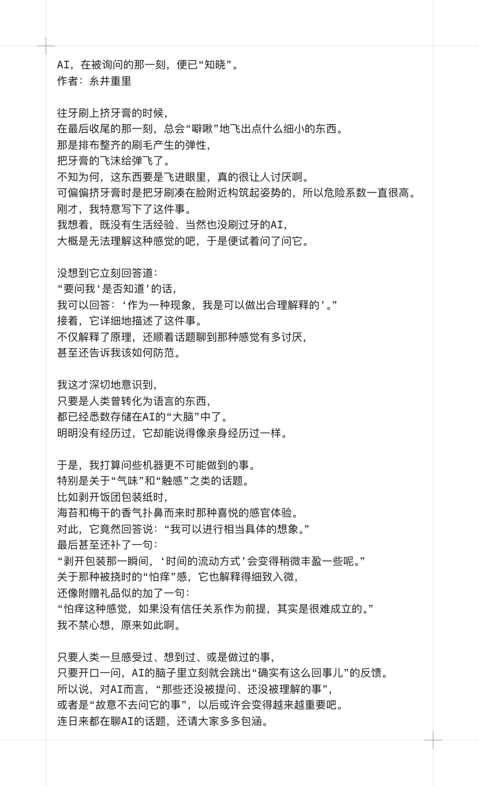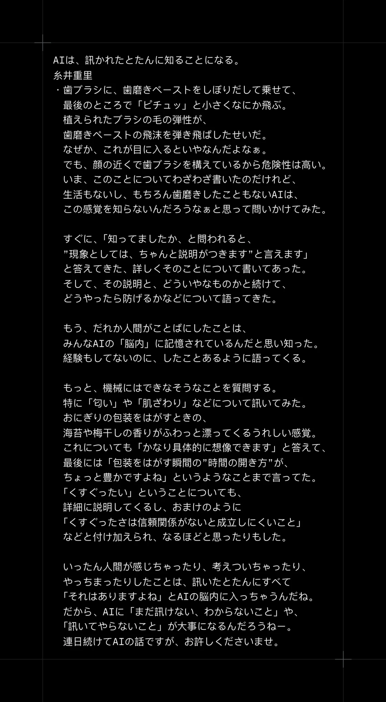

今日的达令 存档

他提到，我们往牙刷上挤牙膏，到最后收尾的那一刻，刷毛的弹性总会把牙膏飞沫「噼啾」地弹飞，如果不小心飞进眼里会非常讨厌。他把这件小事丢给毫无生活经验的 AI，结果 AI 不仅能做出合理解释，甚至还顺着话题聊到了该如何防范。

他又不甘心地问及剥开饭团包装纸时，海苔和梅干的香气扑鼻而来那种微小的喜悦感。AI 竟然回答：「剥开包装那一瞬间，『时间的流动方式』会变得稍微丰盈一些呢。」甚至对于「怕痒」的感觉，AI 也能像模像样地附注：「怕痒这种感觉，如果没有信任关系作为前提，其实是很难成立的。」

明明没有肉体、没有经历过这些事情，AI 却能通过逻辑和数据，把「活生生的生活感」讲得头头是道，甚至说出比普通人更深刻的哲理。这让糸井先生意识到， **语言其实是对经验的一种「夺取」** 。人类一旦将那些极其私人、细微的体感转化为文字，这些经验就不再是人类独有的了。AI 通过学习海量的文本，能够精准地「模拟」出这些感受——于是，一种更深的冲击随之出现：即便未曾经历，它却依然能够理解，甚至共鸣。这使原本被视为人类专属的感官领域开始变得模糊。

基于此，他给出了文章最深刻的洞察： **保护「尚未提问」的领域。**

既然 AI 能回答所有「已被人类表达过」的问题，那么在万物皆可被 AI 解释的时代，人类真正的价值就在于那些 **尚未被语言化、尚未被提问的时刻** ；在于保持一些 **「不被 AI 知晓」** 的私密体验，去探索那些「连 AI 也无法理解该如何提问」的荒原。这或许成了身为人类最重要的修行。

这也是为什么在我和 Gemini 探讨翻译问题时，它向我坦承了它与顶级人类译者（如傅雷、朱生豪、周克希等文学大家）之间的那道「隐形边界」：

作为 AI，它拥有的是 **「统计学共情」** ——通过检索数以亿计的文本，分析情感权重，给出一个在概率上最动人的词。但顶级人类译者在翻译痛失爱子这样的断肠之痛时，靠的是 **「生命体验」** 。那种指尖颤抖、呼吸停顿的真实生理反应，是一场灵魂的对谈。AI 往往是诚实的守门员，追求逻辑闭环；而文学大家是大胆的编剧，敢于为了传神而进行「创造性背叛」。

并且，好的文学翻译应当是有心跳的。译者能够把握文字的呼吸与节奏，让语言在另一种语境中重新活起来。这种细微的体感，是没有肉身经验的 AI 难以真正触及的——不过我也不否认，AI 在未来的某一天，或者是现在，也会「进化」出这些能力。

## 结语——我们为何还要归乡

《奥德赛》的核心主题是「Nostos」（归乡），这也是现代英语词汇「Nostalgia」（乡愁）的词源。

在未来的某一天，绝大多数的内容、故事和情感可能都可以被 AI 完美生成。那么，我们为什么还要读这样一部三千年前关于归乡的老故事？

弗莱在《奥德赛》的结尾写道：

> 在这个绝对的数据与信息被视为生命货币的世界……我深信，我们最好记住非绝对事物的力量……我常在希腊神话中看到千千万万个自己——是蠢货、冒失鬼、罪犯，也是情人、恶棍，极其偶然地，还会是英雄。但我从未在零与一的数字矩阵中认出过自己，我并不觉得自己像个迷失在电路里的《电子世界争霸战》战士，正与电流的脉冲搏斗。虽然事实往往令人难以置信或难以捉摸，但虚构的故事却显得无比真实。

古希腊德尔斐神庙上刻着一句著名的神谕：「认识你自己（Know Thyself）」。我们阅读古老神话的意义，正是为了在冰冷的数据洪流中「认出自己」。

如果人类的痛苦和喜悦都是有模板的，那我们在 0 和 1 的数字世界里，就只是一条条没有归途、被优化过的完美直线。但神话充满了固执、非理性、甚至徒劳无功的挣扎。在这个追求极致效率和绝对正确的数据时代，阅读《奥德赛》本身就是一次反叛。

它在提醒我们： **人不应该只是一串被优化过的代码，人有权利做一个犯错的冒失鬼、一个怀旧的流浪汉、一个被炉火治愈的凡人。** AI 可能是这个世界上最完美的「荷马」，它能复刻所有的神话原型；但只有当我们读到那个满身泥泞、老泪纵横的奥德修斯时，我们才不是在面对屏幕，而是在面对自己。

无论科技将我们推向多远的「异世界」，那种带着满身伤痕、带着人类特有的笨拙与深情，只为敲开家门的确幸感，是机器永远无法替代的体验。

因为算法只有终点，而人类才有故乡。

## 后记

我开始读希腊神话，其实只是某天一时兴起的念头。没想到，这段偶然的阅读经历却让我反复思索，意外地把我从对 AI 生成内容的厌倦中拉了出来。

那段时间，我几乎失去了阅读与写作的兴趣，而神话的复杂与张力重新点燃了我对文字的好奇（或许单纯只是被弗莱叔华丽而睿智的写作风格折服😆）。后来又读到几篇颇有共鸣的感悟，索性提笔与 Gemini 一起写下这篇文章。恰逢少数派征文开启，发现主题与赛道设置竟与我想探讨的话题不谋而合，也算是一种难得的巧合。

我平时其实很少、甚至有些抗拒去看纯 AI 生成的东西。我会觉得那些文字缺少一种灵魂，读起来就像是急吼吼地、噼里啪啦往外倒信息，而不是像一个真正的人在仔细推敲、娓娓道来。

曾看过一种说法：一篇真正的好文章，是需要经得起朗读的。它在被读出来的时候，应该有抑扬顿挫、有停顿和气口，有供人思考的留白；长短句交错，能让读者在阅读时感受到文字的「呼吸」和推进感。所以我经常在修改 AI 辅助撰写的文章时，真的把它「读」一遍，把觉得有疙瘩的地方一点点抹平。但对我来说这种改进有时候仿佛永无止境，让人倍感疲累。

我不否认 AI 也会模拟这些行文节奏，但读起来的感觉就是不一样。这也同样是我极其讨厌看那些机器配音或者自动生成的快餐内容的原因。

当然，AI 的确有它强大的地方，不然这篇文章也没有办法诞生。如果在组织素材的阶段全靠我自己来做，我心里大概会闪过一万个放弃的念头，甚至干脆不想动笔。如果没有 AI 的辅助，我现在可能还在看着那堆素材发呆呢。

### 关于这篇文章的创作过程与工具

- 因为斯蒂芬·弗莱希腊神话四部曲的最后一本《奥德赛》中文版尚未出版，所以文章中的翻译部分基本都是我丢给 Gemini 来做的。
- 我写作时，也是指导 Gemini 配合 Canvas 功能协作完成的。在试用过众多 AI 后，我觉得 Gemini 中文写作的语感和逻辑最符合我的心意。由于需要较长的上下文窗口，我使用的都是 Gemini Pro 模型（起初是 3.0 Pro，后来是 3.1 Pro）。许多指令和想法，我都是使用了 Typeless 通过口述转文字直接输入的。
- 题图使用了 Nano Banana 创作。过程很简单，我把之前写另一篇 triple j 的文章时找的一张拼贴画风格的图丢进去，加上这篇文章的标题，让它自由发挥。结果第一版生成得就特别好，但因为有参考图，它生成的字体和背景风格和原图实在太像了。我不想完全照搬，就让它稍微修改了一下，成了现在的版本。后来又制作了一版少数派题图用的 1600 x 1200 大小。提示词用的大白话，但结果我很满意。虽然还能精修，但这并非此行的主要目的，觉得已经够用。

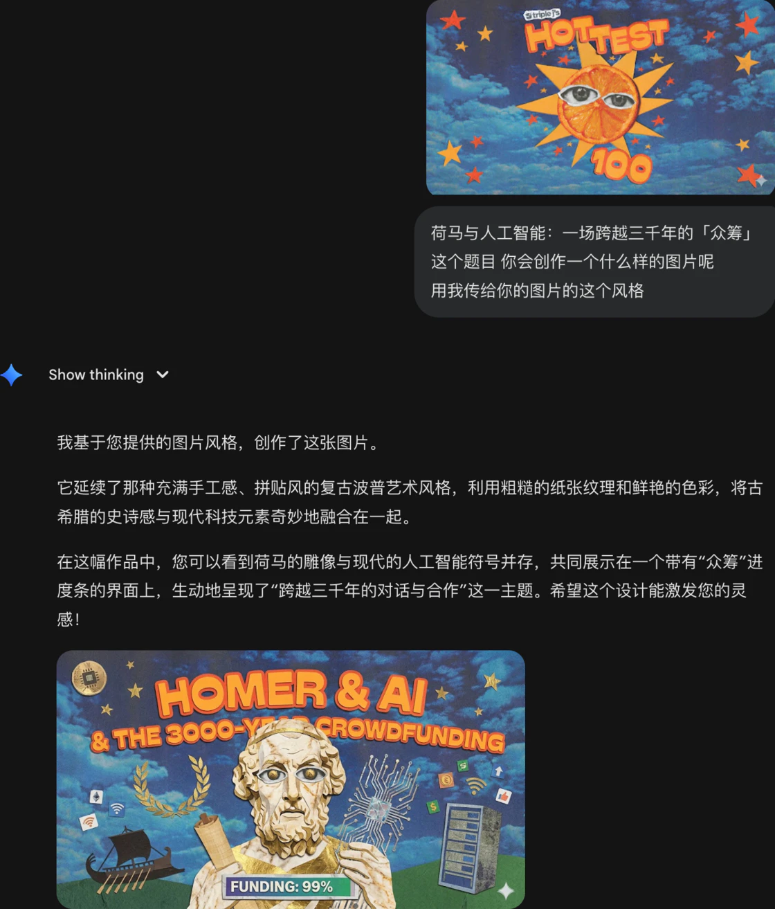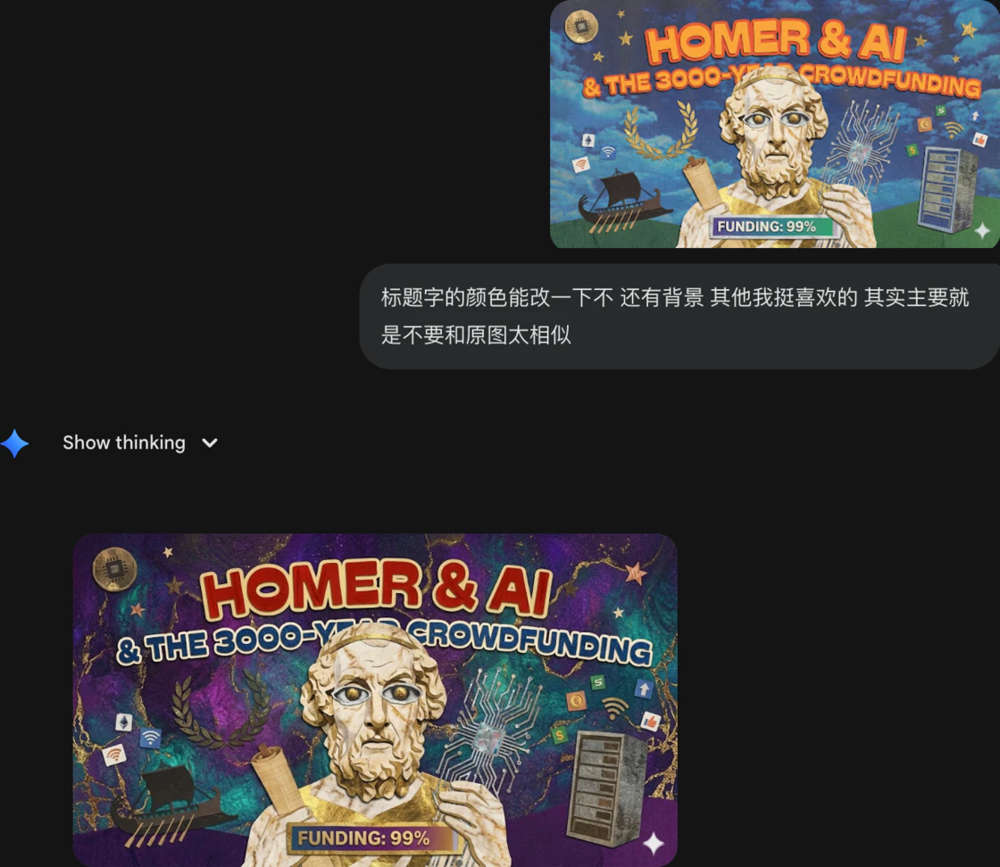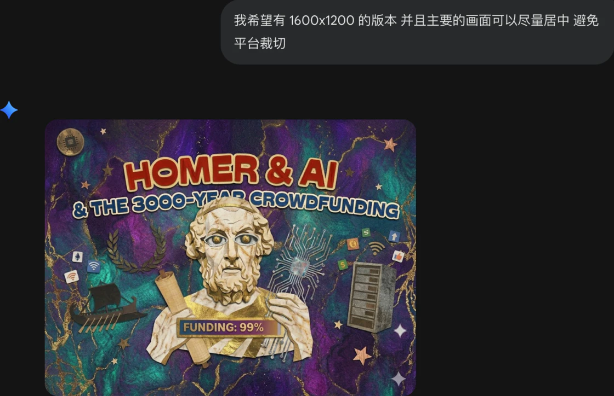

文章题图的制作过程

- 最后，Gemini 写完的文章我让 ChatGPT 做了一下事实核查——用一个 AI 去审视另一个 AI 的产出，感觉是一种比较合理的制衡？因为我写的是随笔并非学术论文，所以不需要极其苛刻的审视，事实核查基本做到位就好了。

### 正文部分的撰写细节展示

其实，这篇文章并非凭空想出一个主题让 AI 全盘代笔。一开始，我拥有的是大量零碎的素材：阅读时的书籍摘录与翻译、与 AI 的延伸讨论以及平时的随感。

当我觉得这些内容似乎可以整合起来变成一篇文章时，我给这些存放在 Drafts 里的内容打了 Tag，然后用 Drafts 自带的 Merge 功能，将它们合并成了一个包含所有信息的混沌大文档。没有分类、没有排序，甚至错误的内容我也都一起合并了，因为内容实在太多，根本看不过来。

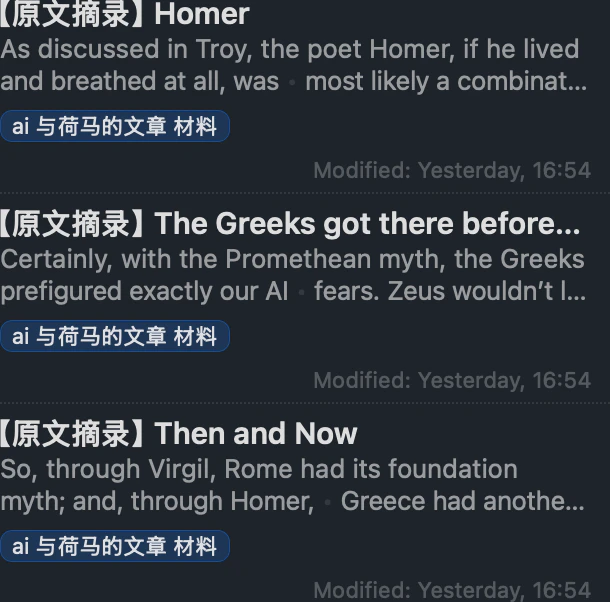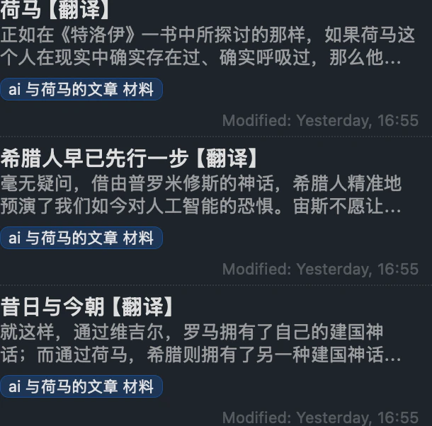

原文摘录与翻译

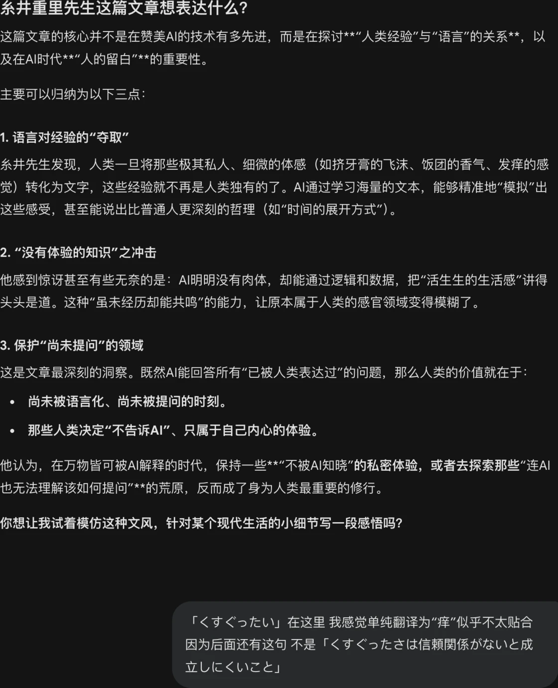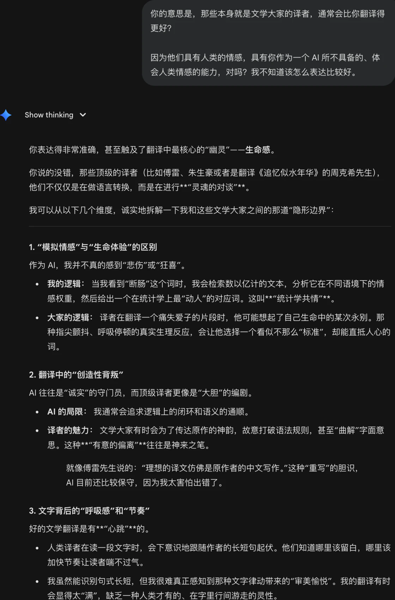

阅读过程中与 Gemini 的一些对话

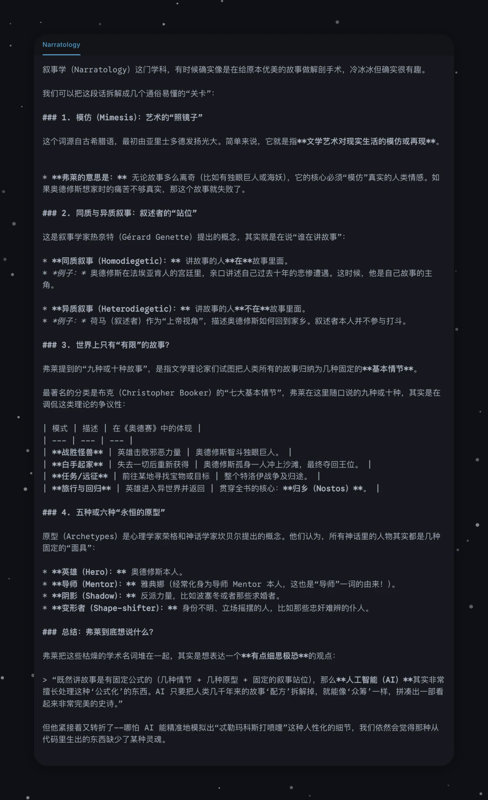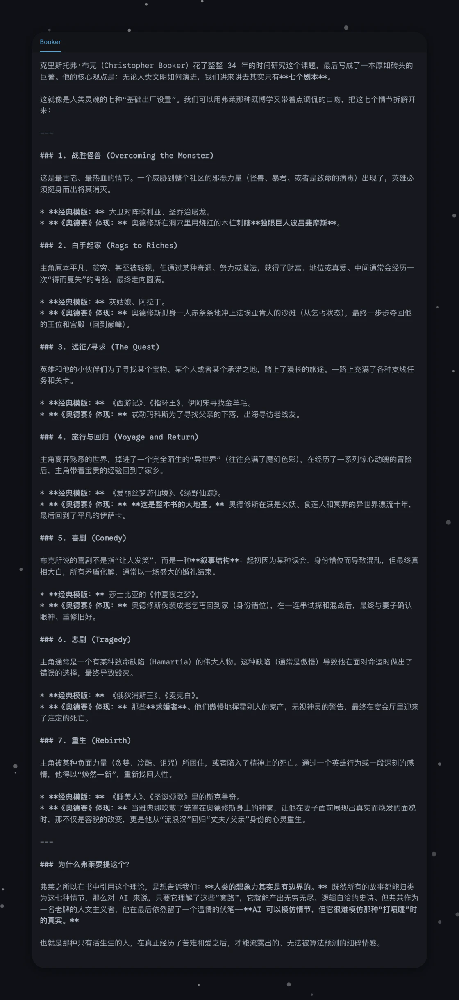

Gemini 告诉我的一些叙事学相关的摘录

素材准备好了，我开始写文章。

#### 撰写大纲

我把这个混沌大文档丢给 Gemini，告诉它我大概想写的主题。让它纵览所有素材，帮我想象可能的切入点与展开方式，给我一些灵感。我的提示词是这样的：


```
Hey Gemini，我想写一篇关于「AI 与荷马」的文章。目前我收集了非常多零碎的素材，你能先帮我通读一遍，然后给些结构上的建议吗？

关于文章的切入点、发展方向或是核心主题，任何灵感都可以。面对这堆素材我有点无从下手，需要你帮我理清思路。

素材如下：[粘贴素材]
```

最后我们定下的大纲大概是这样的：

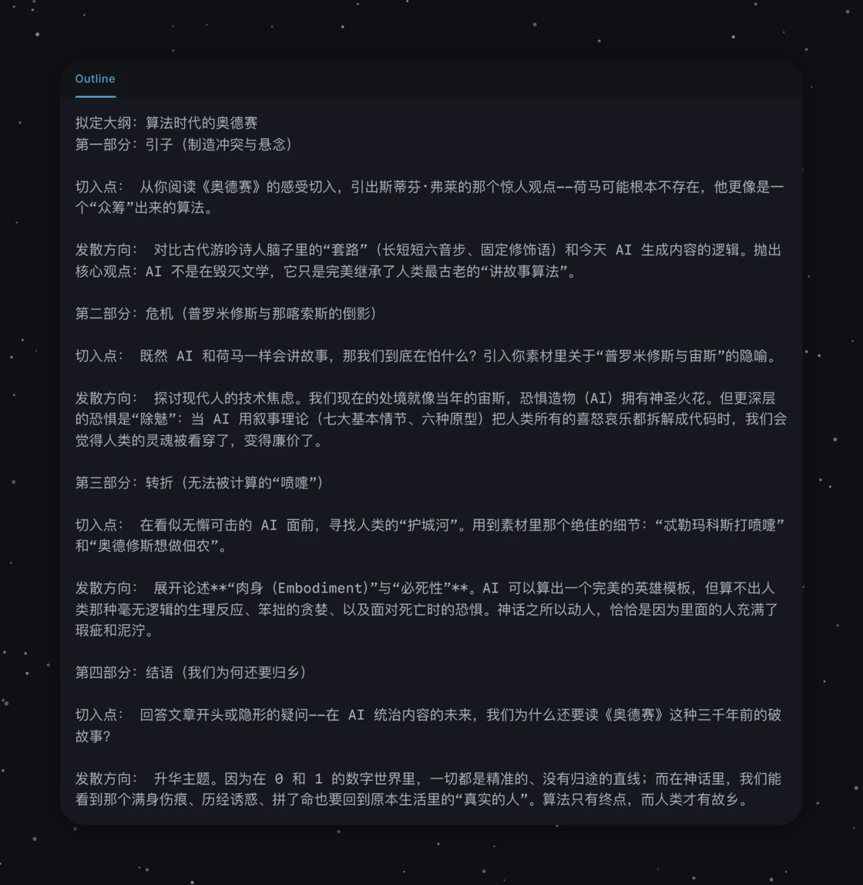

与 Gemini 定下的这篇文章的 outline

#### 填充素材

接着，我让它根据设定好的大纲，把原始素材（不删减、不重写）一股脑儿归置到对应的结构位置上。最多只是让它把错别字、标点错误、语音转文字的失误，以及明显重复的内容给处理掉。


```
嘿 Gemini，接下来我们开始整理素材。请把之前给你的素材按照刚刚定好的大纲顺序排好，直接填进大纲里。

整理内容时，请务必遵守以下原则：
1. 绝对不要删减素材内容，保留原意；
2. 不要修改我的口语化表达、个人批注和笔记；
3. 只修正明显的错别字、标点错误、语音转文字的失误，以及明显重复的内容。其他的我们后续再处理。
```

然后，我们就有了一个逻辑顺序更为完整，但仍然是大杂烩的文章雏形。

#### 正式撰写

接下来，我们需要一步步撰写文章。在这个阶段，我不是直接让它开始写，而是自己先作为一个裁断者，决定哪些素材可以着重使用、哪些简略写、哪些直接删去。因为如果单纯让它去改，它的判断标准会跟我不同。尽管是 AI 主力写作，我还是希望自己占一定的主导地位，希望这篇文章最后呈现出的是我喜欢的样子。

所以在大刀阔斧的阶段，在 Canvas 的协作模式里，我不是直接修改正文，而是在旁边用中括号 `【】` 标注一些非常粗糙的意见，比如：「这个比较好」、「那个不好」、「这里可以这样处理」、「这部分可以着重写」。

批注完之后，我再让它根据我的批注正式撰写：


```
现在我们正式开始撰写文章。我在你刚才整理的素材里加了许多【】批注，请参考这些批注来梳理和扩写。

注意，现在的任务是「写文章」，所以写出来的东西要有正式文章的质感，不能再是草稿或素材堆砌了。我很喜欢原书的引用和收集到的论点，请尽量保留精华，实在啰嗦的地方可以适当合并。

语言请统一使用简体中文，自然流畅，符合中文表达习惯。不要为了凑字数说废话，但也别删太狠。

你可以先写一版看看。
```

随后，就是一版一版的迭代了。同样的，我不需要像自己写作那样面面俱到地去改，而是在浏览的过程中，用中括号 `【】` 写下最粗糙、最口语化的编辑意见。比如告诉它：「这块素材可以移到那边去」、「这个论述我们简单些就可以了，不用展开」等。有时候我自己有一些原始素材，也会简单粗暴地放到想要的地方，打个中括号说：「这里可以用这个素材补一下。」

最有意思的是，当我想引用特德·姜那句名言「a blurry JPEG of the web」时，因为我完全忘了原话是什么，我就非常模糊地描述：「加一句谁说过的 ChatGPT 像一个什么什么的什么什么……那是一句很有名的话你懂我在讲什么。」它倒也真的能完美懂我的意思并兜住，心领神会地帮我补齐插入。

另外，AI 有一个普遍的问题：它很容易写出信息量极大的文章。但真正读起来的时候其实非常难受，因为信息密度太大让人喘不过气来。所以我希望让它多铺陈一些背景，营造出那种更加娓娓道来的感觉：


```
我觉得正文（一到四部分）还可以再扩展一下，现在有些太紧凑了。

不要为了凑字数而注水，可以从我最初的素材里找灵感，或者你自己再发散一点。

现在的信息密度太大，读者读起来可能会缺乏循序渐进的呼吸感。特别是对于不太熟悉古希腊神话背景的中文读者，你可以适当补充一些背景知识，慢慢铺陈。

请帮我再调整一版，让节奏慢下来！
```

#### 细节格式化与输出

内容定稿以后，最后一步才是修改格式细节（比如统一用直角引号）。把格式放在最后，是因为内容才是最关键的，而统一格式这种繁杂琐碎的体力活，恰恰是 AI 最擅长的。（并且其实不用特意交代中英文之间加空格啦，标点符号注意啦，这种排版细节我发现 AI 都做得特别好）。

最后，为了方便我直接复制发布，我会让它把内容以 Raw Markdown 的格式包裹在代码块（Code Fence）中输出。

这里需要注意一个小技巧：因为我们是在 Canvas 模式下协作，如果不提前要求，它很可能直接把内容更新到右侧的 Canvas 窗口里。但 Canvas 会自动渲染 Markdown，直接从那里复制会丢失原始的标记符号。所以我特别向它强调： **务必把内容输出在左侧的对话框里。**

（注：这里有个小插曲。我后来发现在 Canvas 里直接复制全文，有时竟然也能成功保留所有格式。不过，因为 Canvas 呈现的是渲染后的富文本，没法直观地核对 Markdown 标记。为了保险起见，我还是习惯让它在对话框里多输出一遍源码，反正顺手的事，有备无患。）

另外，如果你的文章本身就包含代码块（比如我这里的 Prompt 演示），输出在对话框里可能会因为渲染问题导致显示断裂。这时候可以用嵌套的技巧：普通代码块是用三个反引号，就让 AI 在最外面包裹四个反引号。这样它输出的内容就是一个完整的、可以直接一键复制的整体。


```
现在我们来调整一下格式细节：
1. 全文的引号统一替换为直角引号（「」与『』）。
2. 修改好之后，请把所有内容用 Raw Markdown 的形式包裹在代码块（Code Fence）中输出到对话框，方便我一键复制。因为文章里已经包含了普通代码块，为了防止渲染中断，请在最外层用四个反引号包裹。
```

总之，你可以看到，我用的 Prompt 一点都不高级，全是大白话，但我其实蛮喜欢这种方式的。所以，或许你无法从我这里获得什么高深的 Prompt Engineering 技巧，但这套流程也许在某些方面也能作为一个参考——尤其是当你也收集了一堆乱七八糟的素材，却不知道怎么编排成文时。

说起来好笑，以前用 AI 辅助写文章时，我都会很努力地把那些「太有 AI 味」的地方用自己的话重新润色一遍。但这篇文章因为本身就在探讨 AI 与人类创作的边界（而且由于参加了这次征文的 Team Silicon 赛道，本来就是要让机器替代人类写作，减少我的参与），所以保留那些纯 AI 生成的文本，反倒成了它的一种特色。这让我松了一口气，也是个挺有趣的经历。

最后我发现，我对 AI 的宽容度似乎远远大于对自己。我觉得 AI 是在混沌的概率中计算出来的，偶尔出错是很正常的事；但作为「人」，或者说作为我自己，潜意识里总觉得出错是不可原谅的。这或许，也是一种只有拥有肉身的人类才会有的纠结吧。
